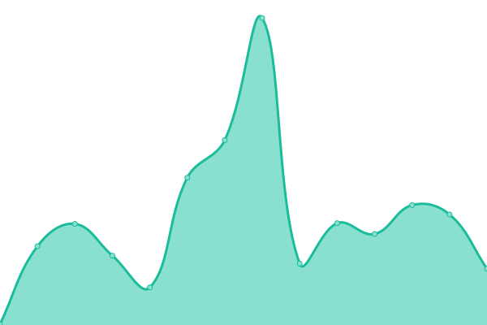
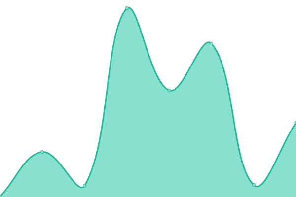
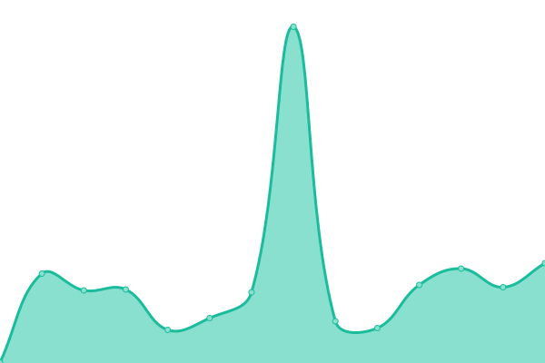

# [📈 Live Status](https://joelwmulongo.github.io/monitoring-): <!--live status--> **🟩 All systems operational**

This repository contains the open-source uptime monitor and status page for [Joel Mulongo](https://joelwmulongo.github.io/monitoring-), powered by [Upptime](https://github.com/upptime/upptime).

With [Upptime](https://upptime.js.org), you can get your own unlimited and free uptime monitor and status page, powered entirely by a GitHub repository. We use [Issues](https://github.com/joelwmulongo/monitoring-/issues) as incident reports, [Actions](https://github.com/joelwmulongo/monitoring-/actions) as uptime monitors, and [Pages](https://joelwmulongo.github.io/monitoring-) for the status page.

<!--start: status pages-->
<!-- This summary is generated by Upptime (https://github.com/upptime/upptime) -->
<!-- Do not edit this manually, your changes will be overwritten -->
<!-- prettier-ignore -->
| URL | Status | History | Response Time | Uptime |
| --- | ------ | ------- | ------------- | ------ |
|  [Personal_Website🌐](https://joelmulongo.vercel.app) | 🟩 Up | [personal-website.yml](https://github.com/JoelwMulongo/monitoringsite/commits/HEAD/history/personal-website.yml) | 

 131ms
     
 | 

<a href="https://joelwmulongo.github.io/monitoringsite/history/personal-website">100.00%</a>
    

|  [My Food App🍝](https://joelfoodordering.netlify.app) | 🟩 Up | [my-food-app.yml](https://github.com/JoelwMulongo/monitoringsite/commits/HEAD/history/my-food-app.yml) | 

 530ms
     
 | 

<a href="https://joelwmulongo.github.io/monitoringsite/history/my-food-app">100.00%</a>
    

|  [Twitter Posts Fetcher🐦](https://twitterpost.vercel.app) | 🟩 Up | [twitter-posts-fetcher.yml](https://github.com/JoelwMulongo/monitoringsite/commits/HEAD/history/twitter-posts-fetcher.yml) | 

 175ms
     
 | 

<a href="https://joelwmulongo.github.io/monitoringsite/history/twitter-posts-fetcher">100.00%</a>
    

|  [Simple Card◼️](https://joelcard.netlify.app) | 🟩 Up | [simple-card.yml](https://github.com/JoelwMulongo/monitoringsite/commits/HEAD/history/simple-card.yml) | 

 481ms
     
 | 

<a href="https://joelwmulongo.github.io/monitoringsite/history/simple-card">100.00%</a>
    

<!--end: status pages-->

[**Visit our status website →**](https://joelwmulongo.github.io/monitoring-)

## 📄 License

- Powered by: [Upptime](https://github.com/upptime/upptime)
- Code: [MIT](./LICENSE) © [Joel Mulongo](https://joelwmulongo.github.io/monitoring-)
- Data in the `./history` directory: [Open Database License](https://opendatacommons.org/licenses/odbl/1-0/)
